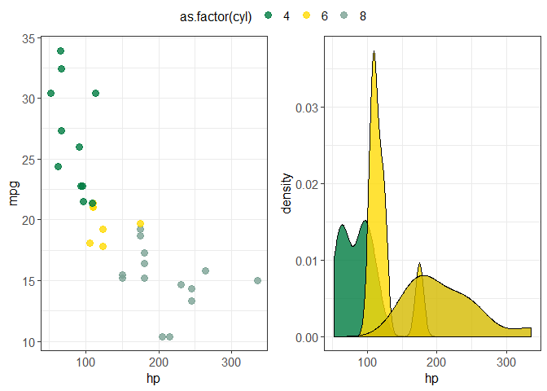
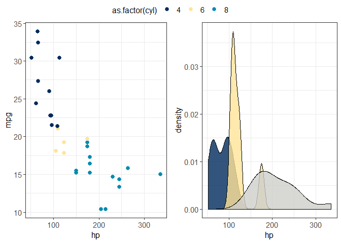
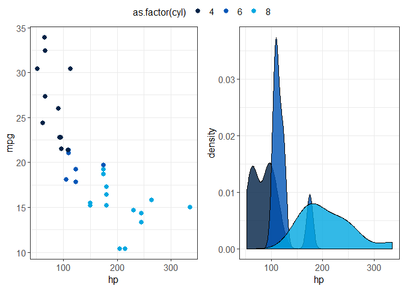

<!-- README.md is generated from README.Rmd. Please edit that file -->

# hueniverrrsity

<!-- badges: start -->

<!-- badges: end -->

A visual identity allows an organization to be instantly recognizable.
Comprised of their logo, typeface, and colours, it is applied when
creating external or internal communications. At universities, staff
create visualizations that adhere to the colour palette specified by
their institution’s visual identity guidelines. For example, on the
[*Students and
Alumni*](https://masterdatascience.ubc.ca/why-ubc/students-alumni) page
of UBC Master of Data Science website, the visualizations all adhere to
the colour palette specified by UBC’s visual identity guideline.

This R package allows users to apply university-specific themes to
ggplot2 objects. This package currently supports the official colour
palettes of four institutions belonging to the U15 Group of Canadian
Research Universities: the University of Alberta, the University of
British Columbia, McGill University, and the University of Toronto. In
the future, we hope to extend this package to support the visual
identities of all universities in the association.

### hueniverrrsity in the R ecosystem

The hueniverrrsity package fits into the R ecosystem with other R
packages that allow users to change the theme of ggplot2 objects. These
types of packages allow general aesthetic theme changes or specific
theme changes for a purpose. One of the most common packages of this
type is
[ggthemes](https://cran.r-project.org/web/packages/ggthemes/index.html),
which allows users to select and apply different general themes to
ggplot2 objects. Our package will be different from ggthemes since the
goal of the change in plot theme is to adhere to university-specific
colour palettes, rather than to generally change the colour and
appearance of plots.

## Installation

You can install the released version of hueniverrrsity from
[CRAN](https://CRAN.R-project.org) with:

``` r
install.packages("hueniverrrsity")
```

And the development version from [GitHub](https://github.com/) with:

``` r
# install.packages("devtools")
devtools::install_github("UBC-MDS/hueniverrrsity")
```

## Usage

Start by importing the following packages:

``` r
library(hueniverrrsity)
library(ggplot2)
```

### `theme_alberta()`

Input:

  - `colour_use`: `fill` or `colour`
      - `colour_use = colour` for `geom_point()` and `geom_line()`
      - `colour_use = fill` for `geom_boxplot()`, `geom_bar()`,
        `geom_violin()` and `geom_histogram()`
  - `colour_palette`: `alpha`, `beta`, `gamma` or `delta`

Available palettes:

`alpha` 

`beta` 

`gamma` 

`delta` 

Output:

  - A ggplot2 object in line with [the University of Alberta’s visual
    identity](https://www.ualberta.ca/toolkit/visual-identity/our-colours)

Example:

``` r
ggplot(data = mtcars, aes(x = hp, y = mpg, colour = as.factor(cyl))) +
  geom_point(size = 2.5) +
  theme_alberta('colour', 'beta')
```



### `theme_mcgill()`

Input:

  - `colour_use`: `fill` or `colour`
      - `colour_use = colour` for `geom_point()` and `geom_line()`
      - `colour_use = fill` for `geom_boxplot()`, `geom_bar()`,
        `geom_violin()` and `geom_histogram()`

Available palette:


Output:

  - A ggplot2 object in line with [McGill University’s visual
    identity](https://mcgill.ca/visual-identity/visual-identity-guide#mcgilllogo)

Example:

``` r
ggplot(data = mtcars, aes(x = hp, y = mpg, colour = as.factor(cyl))) +
  geom_point(size = 2.5) +
  theme_mcgill('colour')
```


### `theme_toronto()`

Input:

  - `colour_use`: `fill` or `colour`
      - `colour_use = colour` for `geom_point()` and `geom_line()`
      - `colour_use = fill` for `geom_boxplot()`, `geom_bar()`,
        `geom_violin()` and `geom_histogram()`
  - `colour_palette`: `vibrant`, `cool` or `awards`

Available palettes:

`vibrant` 

`cool` 

`awards` 

Output:

  - A ggplot2 object in line with [the University of Toronto’s visual
    identity](https://www.utm.utoronto.ca/communications/sites/files/communications/public/shared/UofT%20Style%20Guide%20%2B%20Boundless%20Guide%20Feb%202012.pdf)

Example:

``` r
ggplot(iris, aes(x = Species, y = Sepal.Length, fill = Species)) +
  geom_boxplot() +
  theme_toronto('fill', 'awards')
```



### `theme_ubc()`

Input:

  - `colour_use`: `fill` or `colour`
      - `colour_use = colour` for `geom_point()` and `geom_line()`
      - `colour_use = fill` for `geom_boxplot()`, `geom_bar()`,
        `geom_violin()` and `geom_histogram()`

Available palette:


Output:

  - A ggplot2 object in line with [the University of British Columbia’s
    visual
    identity](https://brand.ubc.ca/guidelines/downloads/ubc-colour-and-fonts/)

Example:

``` r
ggplot(iris, aes(x = Species, y = Sepal.Width, fill = Species)) +
  geom_boxplot() +
  theme_ubc('fill')
```


